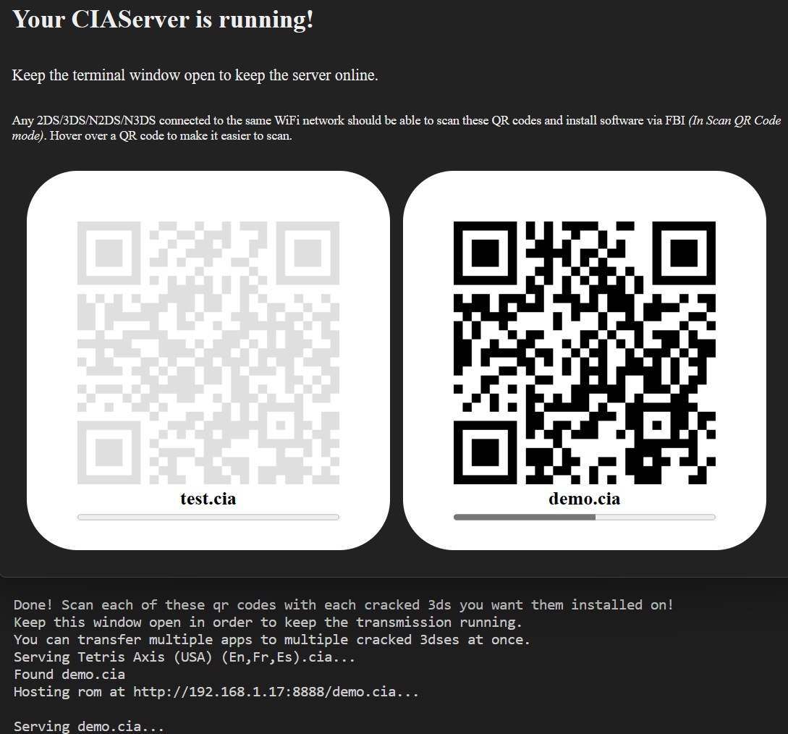

# CIAServer

> *Serves CIA and 3DSX files to any 2DS/3DS/N2DS/N3DS on your local network.*

A simple program that makes it easy to install homebrew software and games to your 3DS without copying files to your SD card.

Compatible with [FBI](https://github.com/Shadowtrance/FBI), the top package installer for 3DS.

## Screenshots

## Download

Go to the releases page for the latest binary, or alternatively, clone the repository, `pip install -r requirements.txt`, and `python main.py`.